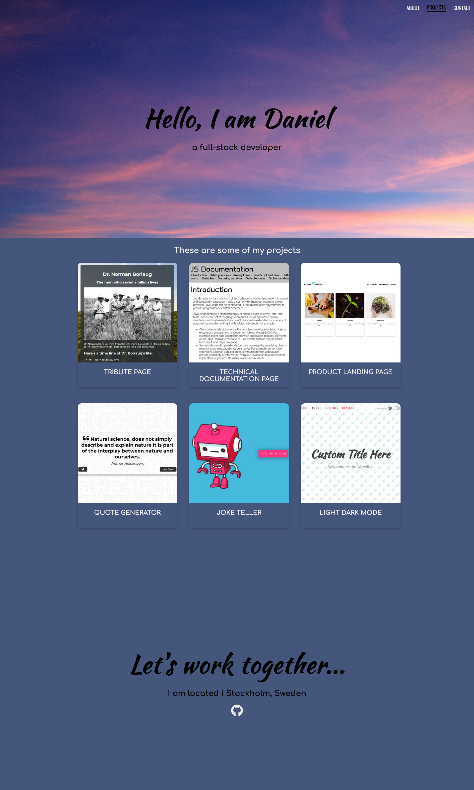

# Personal Portfolio Webpage

The Personal Portfolio Webpage is a visually engaging and responsive showcase of projects, designed as part of the Responsive Web Design Certification by freeCodeCamp. The webpage highlights personal projects and serves as a platform for potential collaborators or employers to connect.

## Table of contents

- [Personal Portfolio Webpage](#personal-portfolio-webpage)
  - [Table of contents](#table-of-contents)
  - [Overview](#overview)
    - [Screenshot](#screenshot)
    - [Links](#links)
    - [Built with](#built-with)
    - [What I learned](#what-i-learned)
  - [Continued development](#continued-development)
    - [Useful resources](#useful-resources)
  - [Author](#author)
  - [Acknowledgments](#acknowledgments)

## Overview

The Personal Portfolio Webpage includes:
- Responsive design for seamless viewing on desktops, tablets, and smartphones.
- A clean and modern navigation menu for easy access to sections.
- Project showcase with interactive cards linking to live demos.
- A contact section featuring social media links for easy communication.

### Screenshot



### Links

- Live Site URL: [GitHub Pages](https://dantvi.github.io/personal-portfolio-webpage/)

### Built with

- HTML5: Semantic structure for accessibility and clean design.
- CSS3:
  - Grid and Flexbox for layout.
  - Custom properties for a consistent theme.
  - Hover effects for interactivity.
- Font Awesome: For social media icons.

### What I learned

This project enhanced my skills in:
- Responsive Web Design:
  - Used media queries to ensure the portfolio is user-friendly on all devices.
- CSS Grid & Flexbox:
  - Created a dynamic project grid that adapts to different screen sizes.
- Interactive Elements:
  - Designed hover effects for cards and icons to improve user engagement.

Here’s a snippet demonstrating the hover effect on project cards:

```css
.card:hover {
    transform: scale(1.05);
    box-shadow: 0 4px 8px 0 rgba(0,0,0,1);
}
```

## Continued development

In future iterations, I plan to:
- Add light/dark mode toggles for better user experience.
- Integrate JavaScript animations for smoother transitions.
- Expand the contact section to include a functional contact form.
- Include a blog section for sharing insights and tutorials.

### Useful resources

- [MDN Web Docs: CSS Grid Layout](https://developer.mozilla.org/en-US/docs/Web/CSS/CSS_grid_layout) - Essential for mastering responsive grid design.
- [CSS Tricks: Flexbox Guide](https://css-tricks.com/snippets/css/a-guide-to-flexbox/) - Helped structure flexible layouts.
- [Font Awesome Documentation](https://fontawesome.com/) - Simplified adding icons to the project.

## Author

- GitHub - [@dantvi](https://github.com/dantvi)
- LinkedIn - [@danieltving](https://www.linkedin.com/in/danieltving/)

## Acknowledgments

Special thanks to freeCodeCamp for providing structured and practical learning opportunities, and to MDN Web Docs for their excellent technical references.
